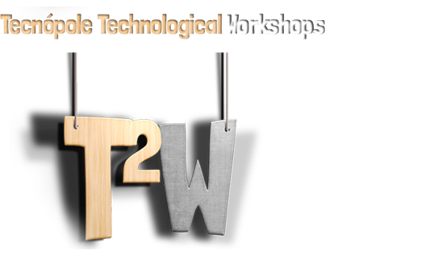

# T2WarBot
 [](https://twitter.com/t2_war)

:question: About
---

This bot was developed during the Tecnópole Technological Workshops 2019.

> All T2W participants will face each other in a pitched battle via... Twitter?

> During the 3 days, 41 people struggle to gain control and control of the Tecnópole camp. They accept the possibility of an imminent defeat, and understand, in their hearts, that there is nothing that can save them.


:vhs: Clone me!
----
Clone or download the project:

```sh
git clone https://github.com/cosasdepuma/t2warbot.git T2WarBot

cd T2WarBot
```

:electric_plug: Requirements
----
If you want to run `T2WarBot` on your computer, you need to install some `Python3` modules:

```sh
pip3 install -r requirements.txt
```

Also you need to specify your Twitter credential tokens. 

> You must be registered on https://apps.twitter.com/

```py
''' t2warbot.py '''

def tweet(tweet_msg):
    CONSUMER_KEY    = " == CENSORED == "
    CONSUMER_SECRET = " == CENSORED == "   
    ACCESS_KEY      = " == CENSORED == "    
    ACCESS_SECRET   = " == CENSORED == "
```

Finally, you need to have a list with the name of the participants in a text file, written line by line. For example:

```sh
Bill Gates
Steve Jobs
Elon Musk
SpongeBob
 ...
```

:runner: Usage
----
To turn on the War Bot, run:

```sh
python3 t2warbot.py
```

You can specify the file with all the usernames in the following way (`alumnos.txt` by default):

```sh
python3 t2warbot.py people.txt
```

:octopus: Support the developer!
----
Everything I do and publish can be used for free whenever I receive my corresponding merit.

Anyway, if you want to help me in a more direct way, you can leave me a tip by clicking on this badge:

<p align="center">
    </br>
    <a href="https://www.paypal.me/cosasdepuma/"></img></a>
</p>


:earth_africa: Scheme of contents
----
```
Polyglot-Code
 < Repository >
|__ .gitignore
|__ .assets
  |__ T2W.png
|__ LICENSE
|__ README.md
< Program >
|__ src
  |__ t2warbot.py
|_ requirements.txt
```

:trophy: And the winner is...
----

> [Adriel](https://twitter.com/t2_war/status/1149673008715292672) has been the first winner of the T2War! Congrats!
----

Please contact with [Kike Puma](https://linkedin.com/in/kikepuma) if you need more information.
